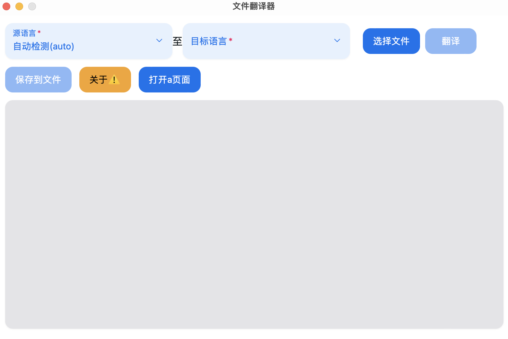

## 这是一个 ii18 文件翻译器 （自己编译下）



#### 支持文件列表

<li>安卓 strings.xml</li>
<li>.json文件</li>
<li>.js文件（仅支持 export defalut 纯对象）</li>
<li>.properties</li>

软件支持 右键打开上述后缀/拖入/手动选择

```
// src/build/index.ts 打包配配置
"packbuild": {
    "build": [
      "index",
      "avg"
    ],  // 需要打包的模块
    "index": {
      "title": "初始化 界面" //每个页面的一些配置
    },
    "avg": {
      "title": ""
    }
  }

```
